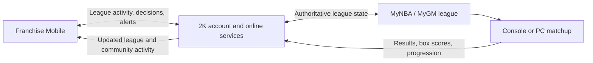

# Franchise Mobile x NBA 2K Integration Positioning

## One-Sentence Pitch

Franchise Mobile turns NBA 2K MyNBA and MyGM into a persistent connected league that users can manage, socialize around, and prepare for from mobile, while console and PC remain the authoritative home of playable NBA 2K games.

## North-Star Vision

Bring the NBA 2K community closer by giving players a shared home that remains active between console sessions.

MyNBA and MyGM are the first integration because Franchise Mobile already demonstrates the league, front-office, commissioner, and social systems required for that experience. The longer-term opportunity is to extend the same connected-community foundation into MyCAREER: teammates finding one another, squad and league organization, scheduled competition, player availability, community events, performance history, and persistent social identity.

This expansion should be presented as a roadmap, not as functionality that already exists or as part of the initial technical request.

## The Product Gap

NBA 2K provides deep on-platform franchise gameplay. Franchise Mobile addresses the time between console sessions:

- League members need a shared place for schedules, negotiations, alerts, rules, and commissioner decisions.
- GMs should be able to manage rosters, scout, prepare coaching plans, review results, and communicate without launching the full game.
- Online leagues weaken when users are absent, schedules stall, or franchise coordination moves into disconnected third-party chats and spreadsheets.
- CPU-controlled vacancies should preserve a functioning league until a human GM takes over.

## The Connected Product Loop

1. NBA 2K creates or links a MyNBA/MyGM league.
2. The league appears in Franchise Mobile under the same 2K account.
3. GMs manage asynchronous league activity from mobile.
4. Matchups are scheduled or requested in the app.
5. The game is played or resolved through NBA 2K's authoritative game systems.
6. Scores, box scores, injuries, standings, awards, and progression synchronize back to mobile.
7. League conversation and the next round of GM decisions begin immediately.

## Proposed Integration Architecture

This is a product concept for technical evaluation. It does not assume that a public NBA 2K integration API currently exists.

The practical implementation could use a 2K-controlled service contract, authenticated account linking, scoped league permissions, event-based synchronization, and server-authoritative conflict resolution. The specific architecture must be determined with 2K and Visual Concepts.

## What Franchise Mobile Contributes

- Persistent league dashboard and schedule.
- GM Lounge, direct communication, reactions, GIFs, moderation, and reporting.
- Trade block, trade rooms, CPU trade logic, and commissioner review.
- Player tiers, archetypes, grades, scouting, potential, and comparison tools.
- Coaching preparation and matchup strategy.
- CPU-controlled teams for vacancies and solo continuity.
- League news, alerts, voting, rules, standings, player statistics, awards, and offseason management.
- Mobile-first reminders that bring users back to NBA 2K to play important games.

## What NBA 2K Remains Responsible For

- Licensed NBA presentation and content.
- Authoritative player, roster, ratings, and rules data.
- Full playable basketball games and gameplay outcomes.
- 2K account identity, entitlements, anti-cheat, and platform services.
- Final synchronization contracts and server authority.

## Strategic Value To 2K

- Extends MyNBA/MyGM engagement beyond active console sessions.
- Creates additional daily touchpoints without requiring users to play a full game.
- Makes private and public leagues easier to organize and sustain.
- Converts league communication and management from external tools into the NBA 2K ecosystem.
- Creates more reasons to return to console or PC for scheduled matchups.
- Provides a foundation for live league events, creator leagues, commissioner programs, and premium connected features.
- Builds a first-party community layer that can eventually connect franchise players, MyCAREER players, squads, creators, and competitive communities.

## Expansion Path Into MyCAREER Community

After proving the connected MyNBA/MyGM loop, the platform could expand into a broader NBA 2K community companion:

- Persistent player and squad identity outside the console.
- Teammate discovery based on position, play style, availability, region, and competitive goals.
- Squad calendars, scheduled sessions, events, and league participation.
- Community hubs for private groups, creator communities, and organized competition.
- Match and season history that gives relationships and rivalries continuity.
- Mobile notifications that bring a complete group back into NBA 2K at the right time.

Franchise Mobile would therefore begin as a franchise companion and grow into connective infrastructure for multiple NBA 2K communities. NBA 2K remains the place where basketball is played; the companion keeps the people and their shared activity connected around it.

## Evidence Of Fit

2K already supports shared console/mobile progress through MyTEAM Mobile. NBA 2K26 also expanded MyNBA/MyGM through online playoffs, adjustable simulations, deeper scenarios, and other franchise investments. Franchise Mobile extends those proven directions into a connected social GM layer.

This is an inference from 2K's published products and feature announcements, not a claim that 2K has announced this specific integration.

## The Initial Ask

Request a focused product and technical evaluation with representatives from:

- NBA 2K product leadership.
- Visual Concepts MyNBA/MyGM development leadership.
- 2K online/platform or mobile product leadership.
- Take-Two strategy or corporate development when commercial structure is discussed.

The desired outcome is agreement on whether to explore a connected prototype, integration pilot, licensing arrangement, partnership, acquisition, or another mutually appropriate structure. The first meeting should establish fit; it should not expose source code or proprietary formulas.

The initial prototype should focus on MyNBA/MyGM. The MyCAREER community expansion should be discussed as the strategic upside that follows a successful first integration.

## Material Reserved For Diligence

- Source code and repository access.
- Simulation and CPU decision formulas.
- Player rating methodology and raw datasets.
- Security architecture and credentials.
- Private roadmap, unreleased modes, and monetization experiments.
- Detailed commercial terms or valuation expectations.
